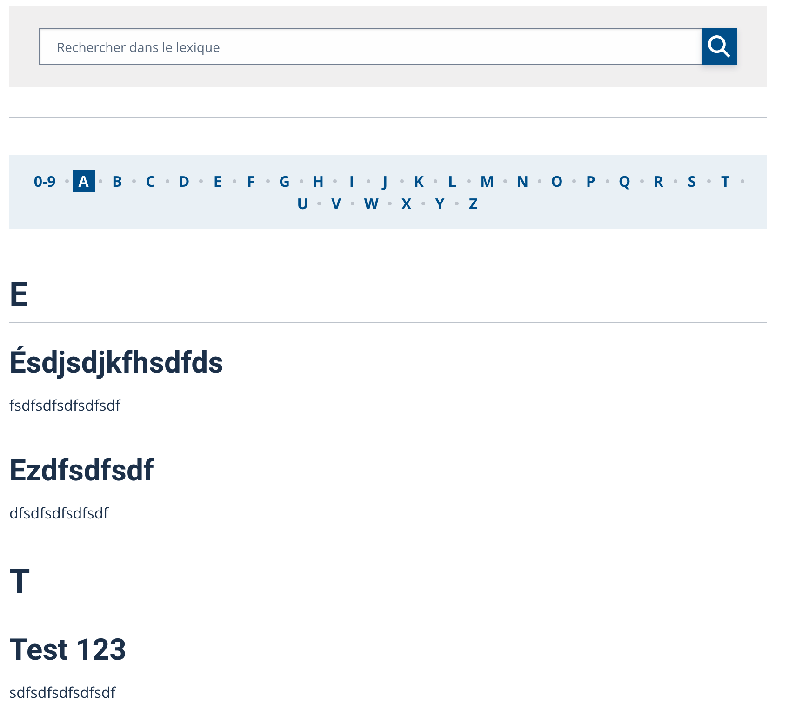

.. include:: ../Includes.txt

.. _introduction:

============
Introduction
============

What does it do?
================

Users can add glossary to their typo3 and display results in a front page

Screenshots
===========

An example of glossary displayed in a page.

